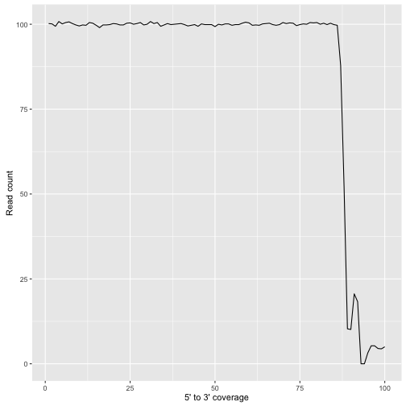

## Drawing a 5' to 3' transcript plot

Often in RNA-seq data we would be interested to examine if there are any bias in the coverage across a transcript. 


This R script shows hows how to draw such a plot and examine if such bias is present in our datasets.


```r
# Generate example coverage data for gene1 (g1)
g1 <- round(
  c(rnorm(866, mean=100),
    rnorm(11, mean=70),
    rnorm(30, mean=10),
    rnorm(7, mean=45),
    rnorm(30, mean=0, sd=0),
    rnorm(56, mean=5)))

length(g1)
```

```
## [1] 1000
```

The coverage data has 1000 values, but for plotting puropses we would not draw a plot of all 1000 base pair. Instead we would like to  *bin* the value into 100 sections. The example below illustrates the point.


`g1` has 1000 data points and we now would like to divide the data into 100 bins. So how do we achive a bin something like below? 


bin1. 1-10  
bin2. 11-20  
bin3. 21-30  
bin4. 31-40  
bin5. ...  
bin97. ...  
bin98. 971-980  
bin99. 981-990  
bin100. 991-1000  


```r
# Lets use a script to do the binning process 
# We use the library binr
# Bining the coverage into 100 bins
library(binr)
binfunc <- bins(1:length(g1), target.bins = 100, max.breaks = 100)
```

Lets examine the output of binr function, especially from *binct* object


```r
binlength <- as.numeric(binfunc$binct) 
length(binlength) # Generates 100 bins
```

```
## [1] 100
```

```r
head(binfunc$binct) # Each individual bin contains 10 values
```

```
##  [1, 10] [11, 20] [21, 30] [31, 40] [41, 50] [51, 60] 
##       10       10       10       10       10       10
```

```r
tail(binfunc$binct)
```

```
##  [941, 950]  [951, 960]  [961, 970]  [971, 980]  [981, 990] [991, 1000] 
##          10          10          10          10          10          10
```

The *binct* object generates 100 bins as specified by the *target.bins* parameter and for each bin, it contains 10 data points. Now, lets assign the orignal coverage values to thier corresponding bins, for example ;


```r
g1[1:10]  # Belongs to bin 1
```

```
##  [1] 102 100  99 100 100 101 100  99 101 100
```

```r
g1[11:20] # Belongs to bin 2
```

```
##  [1] 101 100  99 101 103 101  99  99 100  98
```

```r
g1[21:30] # Belongs to bin 3
```

```
##  [1] 101 101  98 100 100  98 100  98  98 100
```

```r
# and so forth
```

Individualy we would do something like this ;


```r
bin1 <- rep("bin1", each=binlength[1])
bin2 <- rep("bin2", each=binlength[1])
```


```r
# Lets do it in a loop
# Create a category of the bin
binlist <- list()
for (i in seq_along(binlength)){
  binlist[[i]] <-  rep(i, each=binlength[i])
}
bincateg <- unlist(binlist)
```

Lets combine the orignal `g1` coverage data and the bin category into a data.frame

```r
# Data frame containing the coverage and the bin it belongs to
df_cov <- data.frame(value = g1,
                     bin = bincateg)
head(df_cov)
```

```
##   value bin
## 1   102   1
## 2   100   1
## 3    99   1
## 4   100   1
## 5   100   1
## 6   101   1
```


Lets get the mean coverage for each bin


```r
# Get the mean of each bin
library(dplyr)
df_bin <- as.data.frame(group_by(df_cov, bin) %>% 
                          summarise(mean_cov = mean(value)))
dim(df_bin) 
```

```
## [1] 100   2
```


Finally draw the plot with ggplot2


```r
library(ggplot2)
ggplot(df_bin, aes(x=bin, y=mean_cov)) +
  geom_line() + 
  ylab("Read count") +
  xlab("5' to 3' coverage")
```




